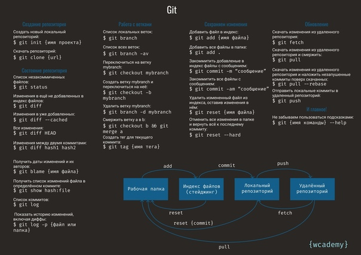
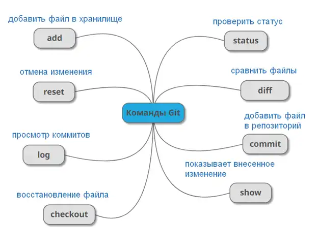

# Инструкция по работе с Git
  
  

Чтобы создать репозиторий, мы используем:  
> git init  
  
Чтобы сохранить файл в Git используется:
> 1. git add filename — добавляет файл с именем **filename**  
> 2. git add . — сохраняет ***абсолютно все файлы***  
  
Чтобы увидеть журнал коммитов нужно использовать:  
> git log  
  
Чтобы посмотреть предыдущие сохранения нужно ввести нижеприведённую команду:  
> git checkout **** — звездочки указывают на 4 первые буквы кода комита  
>> git checkout master — возвращает актуальное состояние и продолжает работу 
>>> *чтобы посмотреть код комита введите команду* ***get log***   
  
Чтобы узнать статус Git нужно ввести команду:  
> git status  
  
Чтобы создать коммит нужно ввести команду:  
> git commit -m "message" — вместо message нужно вписать описание коммита  
>> Данную команду нужно вводить после сохранения   
  
Чтобы увидеть разницу между текущим файлом и закоммиченным файлом нужно ввести:  
> git diff  
  
Для того чтобы посмотреть список всех веток в репозитории вводим команду:  
> git branch  
  
Чтобы создать ветку, используем:  
> git branch branch_name:  
создаётся ветка с именем **branch_name**  
  
Для того чтобы перейти к другой ветке нужно ввести команду:  
>git checkout *название ветки*  
  
Если потребуеться удаление ветки:  
>git branch -d *название ветки*  
>>Есть различия между **-d** и **-D**. В случае вводи **-d** удаляеться ветка которая учавствовала в слиянии веток. **-D** удаляет любую ветку ~~раз и навсегда~~ безвозвратно.  
  
# Работа с внешним репозиторием Git  
  
Для того чтобы скопировать внешний репозиторий на локальный ПК нужно ввести:  
>git clone <url-адресс репозитория>  
  
Чтобы получить изменения и слияние с локальной версией нужно ввести:  
>git pull  
  
Для того чтобы отправить локальный репозиторий на внешний нужно ввести:  
>git push

### Ссылки для ознакомления с Git:  
**[Git для новичков (часть 1)](https://habr.com/ru/post/541258/)**  
**[Git для новичков (часть 2)](https://habr.com/ru/post/542616/)**  
  
